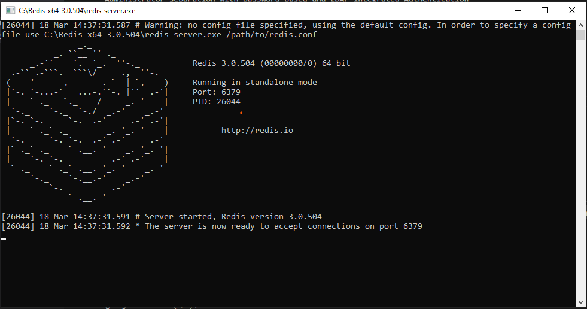
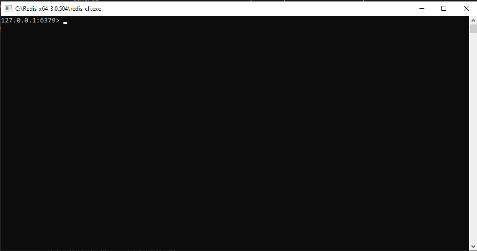
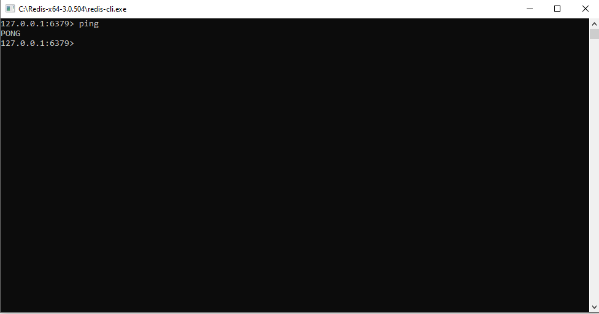

# Spring Boot Redis

## Install & Setup Redis
For Windows
1. Download [Redis for Windows](https://github.com/MicrosoftArchive/redis/releases) and [Redis for Linux](https://redis.io/download)
2. Unzip the downloaded file for windows and for Linux untar it

        tar -xvf redis-stable

    In Linux we have to run the `make` command in the redis directory to make the executable file

        cd redis-stable
        make
3. Start the Redis Server 
    
    for Windows

        redis-server.exe

    for Linux

        src/redis-server
    
    
4. Now to use Redis start `Redis CLI`

    for Windows

        redis-cli.exe
    
    for Linux

        src/redis-cli

    
5. To check Redis is setuped, try typing

        ping
    
    
## Redis Notes

https://github.com/aman7797/super-pancake/tree/master/Learn%20Redis%20And%20Utilize%20Jedis%20With%20Spring%20Data%20Redis

## Repository

1. [Redis Master Slave](https://github.com/aman7797/spring-boot-redis/tree/master/Redis%20Master%20Slave)
2. [Redis Sentinel](https://github.com/aman7797/spring-boot-redis/tree/master/Redis%20Sentinel)
3. [Redis Cluster](https://github.com/aman7797/spring-boot-redis/tree/master/Redis%20Cluster)
